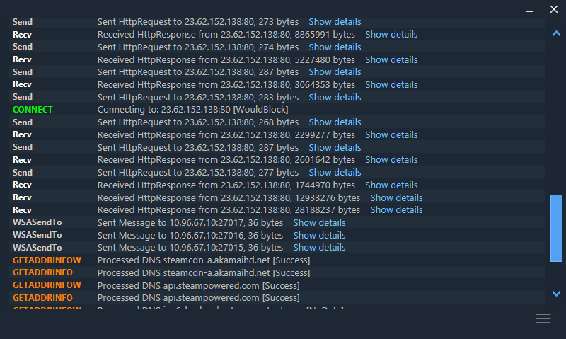

 
 
# [SKYNET] Net Redirector
[SKYNET] Net Redirector is a network sniffer created to debug the connection of applications and have details of the traffic it generates.




## 🔗 Features
```
DNS forwarding             Redirects a dns to a specified address
IP Redirect                Redirect an IP address to a specified IP address
Port forwarding            Redirects a port to a specified port
Dump traffic               Show traffic payload in console or save it to file.
Plugin system              Load external plugin to implement new features.
```

## 🔗 Hooked functions

| Library | Function |
|----------|------------ |
| crypt32.dll | CertVerifyCertificateChainPolicy |
| kernel32.dll | CreateProcessA |
|  | CreateProcessW |
| ntdll.dll | LdrLoadDll |
| ws2_32.dll | connect |
|   | getaddrinfo |
|   | GetAddrInfoExA |
|   | GetAddrInfoExW |
|   | GetAddrInfoW |
|   | gethostbyname |
|   | socket |
|   | recv |
|   | send |
|   | sendto |
|   | connect |
|   | listen |
|   | recvfrom |
|   | WSAConnectByNameA |
|   | WSAConnectByNameW |
|   | WSAConnect |
|   | WSASocketW |
|   | WSARecv |
|   | WSARecvFrom |
|   | WSASend |
|   | WSASendTo |

## 🔌 Plugin system
The plugin system is designed to add features to the program, the following example shows a basic plugin. <br /><br />

**Interface for plugin:**
```csharp
namespace SKYNET.Plugin
{
    public interface IPlugin : IDisposable
    {
        HookInterface HookInterface { get; set; }
        Main Main { get; set; }
        List<IHook> Hooks { get; set; }
        void Initialize(Main main, HookInterface @interface);
        void ModuleLoaded(string module);
    }
}
```
**Plugin example:**
```csharp
namespace SKYNET.Plugin
{
    public class Plugin : IPlugin
    {
        public HookInterface HookInterface { get; set; }
        public Main Main { get; set; }
        public List<IHook> Hooks { get; set; }

        public void Initialize(Main main, HookInterface @interface)
        {
            Main = main;
            HookInterface = @interface;
            Hooks = new List<IHook>();

            Hooks.Add(new ReadFile());
        }

        public void ModuleLoaded(string module)
        {
            Main.Write("Plugin", $"Loaded module {module}", Color.BurlyWood);
        }

        public void Dispose()
        {
            // TODO:
        }
    }
}
```

```csharp
namespace SKYNET.Hook
{
    public class ReadFile : IHook
    {
        [UnmanagedFunctionPointer(CallingConvention.StdCall, CharSet = CharSet.Unicode, SetLastError = true)]
        private delegate bool ReadFileDelegate(IntPtr hFile, IntPtr lpBuffer, uint nNumberOfBytesToRead, out uint lpNumberOfBytesRead, IntPtr lpOverlapped);
        private ReadFileDelegate _ReadFile;

        public override string Library => "kernel32.dll";
        public override string Method => "ReadFile";
        public override LocalHook Hook { get; set; }
        public override Color Color => ColorTranslator.FromHtml("#FF33B4");

        public override Delegate Delegate
        {
            get
            {
                _ReadFile = Marshal.GetDelegateForFunctionPointer<ReadFileDelegate>(ProcAddress);
                return new ReadFileDelegate(Callback);
            }
        }

        private bool Callback(IntPtr hFile, IntPtr lpBuffer, uint nNumberOfBytesToRead, out uint lpNumberOfBytesRead, IntPtr lpOverlapped)
        {
            bool result = _ReadFile(hFile, lpBuffer, nNumberOfBytesToRead, out lpNumberOfBytesRead, lpOverlapped);

            try
            {
                StringBuilder filename = new StringBuilder(255);
                GetFinalPathNameByHandle(hFile, filename, 255, 0);

                if (string.IsNullOrEmpty(filename.ToString()))
                {
                    return result;
                }
                string file = filename.ToString().Replace(@"\\?\", "");
                string Message = $"Reading file {file}";
                Write(Message);
            }
            catch 
            {
            }
            return result;
        }

        [DllImport("Kernel32.dll", SetLastError = true, CharSet = CharSet.Auto)]
        static extern uint GetFinalPathNameByHandle(IntPtr hFile, [MarshalAs(UnmanagedType.LPTStr)] StringBuilder lpszFilePath, uint cchFilePath, uint dwFlags);

    }
}
```
